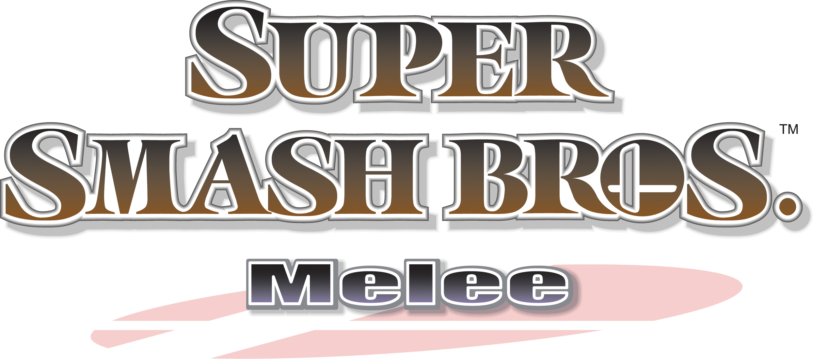

# Melee Native — Miyoo Flip V2 fork

Experimental ARM64 port for the Rockchip RK3566 / Mali-G52 Miyoo Flip V2.
Rendering, audio, and controls work; **solid 60 FPS is not yet achieved**.

Start with the [consolidated handoff](native/FLIP_HANDOFF.md) and
[Flip build and installation instructions](native/FLIP.md). The `miyoo-flip`
branch contains the port, renderer patches, profiling tools, and validation
reports. No ROM or Flip binary release is included. The original macOS/Linux
project documentation and download links follow below.

<p align="center">
  
</p>

<h1 align="center">Melee Native</h1>

<p align="center">
  <strong>Native ports for macOS and Linux.</strong>
</p>

<p align="center">
  <a href="https://github.com/jonrosner/melee-native/releases/download/v0.1.0/Melee-Native-macOS-arm64.dmg"></a>
  <a href="https://github.com/jonrosner/melee-native/releases/download/v0.1.0-linux.1/Melee-Native-Linux-x86_64.tar.gz"></a>
</p>

<p align="center">
  Apple Silicon + Metal &nbsp; · &nbsp; Linux x86-64 + Vulkan<br>
  <sub>Experimental builds. Your own Melee US 1.02 image required. No game disc included.</sub>
</p>

<p align="center">
  <a href="#play-on-macos">macOS setup</a> &nbsp; · &nbsp;
  <a href="#play-on-linux">Linux setup</a> &nbsp; · &nbsp;
  <a href="https://github.com/jonrosner/melee-native/releases">All releases</a>
</p>

---

An experimental native port of Super Smash Bros. Melee for Apple Silicon macOS
and x86-64 Linux, based on
[doldecomp/melee](https://github.com/doldecomp/melee). The recovered game code
runs natively, with Aurora translating GameCube graphics calls to Metal on
macOS and Vulkan on Linux. No Dolphin installation or CPU emulation is required.

Both platforms share the **`main` branch** and game code. This fork preserves
the upstream history; original decompilation instructions are preserved in
[the upstream README](.github/UPSTREAM_README.md).

<details>
<summary>Source layout</summary>

```text
src/                       Shared recovered game code
native/                    Shared native runtime and platform interface
  platform/macos/          macOS launcher, app resources and bundle metadata
  platform/linux/          Linux launcher, desktop entry and Arch packaging
  tools/                   Build, packaging and test scripts
  tests/                   Component and gameplay tests
.github/workflows/         macOS and Linux CI for main
```

</details>

## Play on Linux

[Download the Linux x86-64 app](https://github.com/jonrosner/melee-native/releases/download/v0.1.0-linux.1/Melee-Native-Linux-x86_64.tar.gz),
extract it and run `melee-native`. Select your own Melee US 1.02 image, then
choose **No** at the save prompt. Requires Ubuntu 24.04 or compatible glibc 2.39+
Linux, hardware Vulkan drivers, and a desktop/audio session.

[Linux build and packaging instructions](native/LINUX.md) include GPU selection,
Arch/Omarchy packages, and the limits of the Ubuntu hardware validation.
[All release downloads](https://github.com/jonrosner/melee-native/releases/tag/v0.1.0-linux.1)
include the Arch package and matching macOS app. No disc image or extracted
game assets are included.

## Play on macOS

Requires an Apple Silicon Mac running macOS 15.5 or newer and your own
**Melee US 1.02 disc image (GALE01, revision 2)**. ISO, GCM, CISO and RVZ work.
Game assets and disc images are not included or downloaded by the project.

**[Download for macOS (Apple Silicon)](https://github.com/jonrosner/melee-native/releases/download/v0.1.0/Melee-Native-macOS-arm64.dmg)**

Experimental v0.1.0 · [Release notes and ZIP download](https://github.com/jonrosner/melee-native/releases/tag/v0.1.0)

Open the **DMG**, drag **Melee Native** to **Applications**, and open the app.
Drop your disc image into the setup window or click **Choose File**. Once it is
validated, click **Play**. Keep the image accessible while playing.
The app remembers your image and opens the game automatically on later launches.
If the image becomes unavailable, setup offers to locate it again.

The **Melee Native** app menu includes **Controls**, **Change Disc Image and
Restart**, and **Open Logs**. Changing the image ends the current game session.
The graphical app starts without saving and skips the unsupported initial save
prompt. Command-line diagnostic launches retain the original memory-card flow.

Development packages are ad-hoc signed, not Apple-notarized. Developer ID
signing and notarization remain outstanding. Homebrew is needed for the build
instructions below, not to run a packaged app.

| Key | Action |
| --- | --- |
| WASD | Move |
| X | Attack / confirm |
| Z | Special / back |
| C / V | Jump |
| Q / E | Shield |
| R | Grab |
| IJKL | C-stick |
| Return | Start / pause |

The game window receives keyboard focus when you click Play. Logs are written to
`~/Library/Logs/Melee Native/game.log` when launched through the app picker.

## Build from source on macOS

Install **Xcode 26.2** and Homebrew. Select Xcode's toolchain rather than an
older standalone Command Line Tools installation, then build:

```sh
export DEVELOPER_DIR=/Applications/Xcode.app/Contents/Developer
xcodebuild -version
brew install cmake ninja python ruby pkg-config fmt libpng freetype zstd
python3 native/tools/bootstrap.py
cmake -S native -B build/native-app -G Ninja \
  -DCMAKE_BUILD_TYPE=Debug -DCMAKE_OSX_DEPLOYMENT_TARGET=15.5
cmake --build build/native-app --target melee_mac all --parallel 4
ctest --test-dir build/native-app -L melee --output-on-failure
ruby native/tools/package_app.rb build/native-app dist/local
```

Run these commands from the repository root. Bootstrap pins Aurora to
`749d6ee7a22bdfab78c8ece9047bca5d79aa72ca`; CMake downloads its dependencies,
including prebuilt Dawn and nod libraries. A network connection is required.
Building and the asset-free component tests require no game image. Font data
embedded in the original executable is loaded from the selected disc at runtime.

The package command creates `dist/local/Melee Native.app`, a DMG and a ZIP. Choose a
new destination for each package; the tool refuses to overwrite an existing app.
The app includes an SSBM logo icon; its source notice is in `native/platform/macos/resources`.

For a public release, set `MELEE_SIGN_IDENTITY` to a **Developer ID Application**
identity and `MELEE_NOTARY_PROFILE` to a configured `notarytool` Keychain profile
when running the package command. Packaging signs bundled libraries with the
hardened runtime, notarizes the app and DMG, and staples their tickets. Without
those settings, the default remains an ad-hoc-signed development package.
Disc-backed integration tests are registered separately when local extracted
test assets exist. Public CI does not have those assets and does not test gameplay.

## Status and limitations

The [recorded VS smoke tests](native/validation/2026-09-08/REPORT.md) cover
29 selectable stages, 26 character entries and 35 common item kinds in short
matches. The keyboard-to-match-to-Results flow also passed. These historical
reports span multiple targeted builds and are not exhaustive acceptance.

- Saving does not work yet.
- Adventure, target stages and other modes are outside the current VS coverage.
- Not all moves, costumes, Kirby copy abilities, effects or combinations are verified.
- Rendering targets 60 FPS; a locked 60 FPS is not verified.
- Intel Macs and Windows are not supported by this build.

When reporting a bug, include the build revision, stage, characters, item or
move, reproduction steps and relevant log excerpt. Do not attach game assets.

## Credits and notices

The decompilation work comes from the contributors to
[doldecomp/melee](https://github.com/doldecomp/melee). Native graphics and
platform support use [Aurora](https://github.com/encounter/aurora) and its
dependencies. Packaging includes third-party notices; additional notices are
preserved in [native/licenses](native/licenses).

No disc image, extracted game assets or console firmware are distributed.
Recovered game code is still present. Excluding external assets does not
establish redistribution rights for that code. Existing notices are preserved;
this fork does not apply a new blanket license to upstream material.
