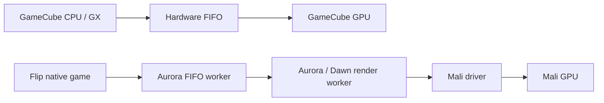

# Flip threading experiments and native-port research

## Hardware measurements

The tested Flip exposes four Cortex-A55 CPUs, but stock Ports settings left
CPUs 2 and 3 offline. The existing application already has a main/game thread,
Aurora FIFO processor, Aurora render worker, SDL audio thread, preload/cache
workers, and several proprietary Mali driver workers.

The same scripted Fox/Mario Onett match was used. Core count and affinity were
changed in the running process. Short windows include changing combat/draw
counts, so these are comparative samples, not a fixed-scene benchmark or a
locked-FPS claim. All GPU correctness barriers remained enabled.

| Experiment | Samples | Mean frame ms | Approx. FPS | Submission ms/draw |
| --- | ---: | ---: | ---: | ---: |
| Existing FIFO, two cores | 90 | 288.3 | 3.47 | 0.613 |
| Existing FIFO, four cores | 113 | 234.6 | 4.26 | 0.475 |
| Render/driver pinned separately, other workers on CPUs 0–1 | 80 | 319.3 | 3.13 | 0.663 |
| FIFO batch 16, four cores | 68 | 226.8 | 4.41 | 0.471 |
| FIFO batch 16, two cores | 52 | 303.0 | 3.30 | 0.649 |

Four cores improved the uncontaminated short samples by approximately 23–34%
in FPS. In the first comparison, render-worker run-queue waiting fell from
4.65 seconds to 0.72 seconds per 25-second window; the Mali backend worker fell
from 8.56 seconds to 1.66 seconds. Dedicated-core pinning was slower. FIFO batch
16 showed no convincing additional gain over the ordinary four-core case and
was reverted. See [summary](threading/summary.json) and the neighboring CSV and
thread-accounting JSON files.

Later repeat windows suffered extreme memory pressure and are excluded from
the performance table. The first long run ended with a kernel-confirmed OOM
kill; a second run stalled without an overlapping upload, requiring device
recovery. This is a real longer-run limitation. The first run's upload is an
additional confound, not an adequate explanation for the repeated failure.

A launcher change enables offline CPU cores only while the game runs and
restores their previous state on exit, without changing clock frequencies.
`MELEE_FLIP_ALL_CORES=0` preserves the firmware's core selection. Four-core activation and restoration after watchdog termination are confirmed
on hardware. Local tests cover successful exit, child failure,
SIGTERM forwarding/restoration, and opting out.

Reducing the texture content-cache budget from 128 to 16 MiB and unused object
retention from 600 to 32 frames did not prevent memory growth. Adding a
per-frame glFinish also failed to prevent it. Both tests were stopped by a
memory watchdog before exhaustion; both experiments were reverted.

## What other projects do

- **Dusklight (Twilight Princess native port)** uses Aurora. Its documented
  preferred backends are D3D12, Vulkan and Metal; OpenGL ES is best effort and
  is explicitly not promised full accuracy/performance. Aurora separates FIFO
  processing and rendering into worker threads—the architecture already used
  here. [Dusklight](https://github.com/TwilitRealm/dusklight),
  [FIFO worker](https://github.com/encounter/aurora/blob/main/lib/gx/fifo.cpp),
  [render worker](https://github.com/encounter/aurora/blob/main/lib/gfx/render_worker.cpp).
- **Shipwright (Ocarina of Time native port)** gives audio its own thread and
  uses queued background extraction work. This is subsystem parallelism;
  these sources do not demonstrate splitting ordered graphics calls across
  arbitrary workers. Our port already separates audio and preloading.
  [Audio thread state](https://github.com/HarbourMasters/Shipwright/blob/develop/soh/soh/OTRAudio.h),
  [background extraction](https://github.com/HarbourMasters/Shipwright/blob/develop/soh/soh/OTRGlobals.cpp).
- **Dolphin is an emulator, not a decomp port**, but provides useful GX
  experience: separating CPU and GPU work improves speed while introducing
  synchronization hazards. Its 2509 report describes both gains and stability
  problems. It does not establish a fix for this Flip driver.
  [Dolphin 2509 report](https://dolphin-emu.org/blog/2025/09/16/dolphin-progress-report-release-2509/).

Dawn explicitly serializes a shared EGL context: different threads can take
turns using it, but cannot use it simultaneously. Therefore, inference from
this implementation and our measurements is that adding draw-submission
threads around the same context would add contention while retaining the
barrier cost. [Dawn context implementation](https://github.com/encounter/dawn/blob/1155e0ed531126f33a1279afa029349651ca1c93/src/dawn/native/opengl/ContextEGL.h).

The supported immediate optimization is allowing existing workers to use all
four cores. Larger gains require reducing serialized driver work (fewer draws
or a proven alternative to the per-draw workaround), alongside resolving the
observed memory-pressure failure. None of the reviewed sources establishes an
exact fix for this stock Mali g13p0 DATA_INVALID_FAULT.

## Mobile draw calls versus GameCube submissions

Mobile applications normally reduce CPU/driver overhead by batching geometry
with compatible render state, instancing repeated meshes, and overlapping CPU
preparation with queued GPU execution. A draw call does not normally imply a
CPU wait for completed rendering. [Arm's application performance guidance](https://developer.arm.com/community/arm-community-blogs/b/mobile-graphics-and-gaming-blog/posts/mali-performance-5-an-application-s-performance-responsibilities).

GameCube GX commands and vertex data traveled through a hardware FIFO. The
write-gather path batches 32-byte bursts; the GPU command processor consumes
the stream asynchronously. The native SDK closely matches the console's
hardware rather than translating GX state into another graphics API.
[Dolphin gather-pipe implementation](https://github.com/dolphin-emu/dolphin/blob/master/Source/Core/Core/HW/GPFifo.h),
[command processor implementation](https://github.com/dolphin-emu/dolphin/blob/master/Source/Core/VideoCommon/CommandProcessor.cpp).

Here, GX's fixed-function behavior becomes shader programs, buffers, textures,
and modern draw commands. The extra per-draw texture-fetch barrier is a local
workaround for an observed driver fault, not a general requirement of GX or
OpenGL ES. Increasing CPU concurrency helps driver scheduling but does not
remove this synchronization cost. The renderer already merges compatible
consecutive GX draws; merging across differing transforms/material state needs
additional design and correctness validation.

Follow-up [real-game barrier isolation](BARRIERS.md) now includes seeded random
subsets and runtime single-barrier switching. Default synchronization remains
conservative; no broadly safe reduced-barrier optimization is established.
